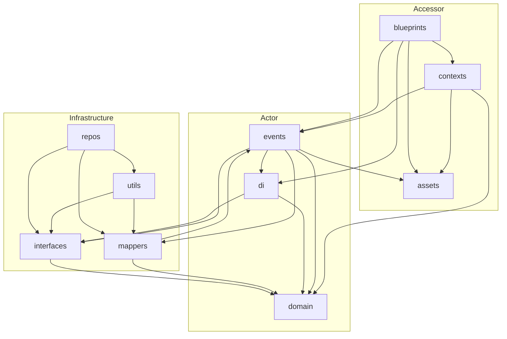

# Architecture – Tiferet v2

## When to use
- Before starting any implementation that touches more than one layer.
- When deciding which layer a new class or function belongs in.
- When verifying that import statements respect layer boundaries.
- Read in combination with `tiferet-code-style` and the relevant component skill.

## Layer graph

Tiferet v2 packages sit in three layers. **Upper layers depend on lower ones; lower layers never import from upper ones.**

```
┌─────────────── Accessor ────────────────┐
│   assets       contexts     blueprints  │
└─────────────────────────────────────────┘
           ↓           ↓           ↓
┌─────────────── Actor ───────────────────┐
│   domain        events         di       │
└─────────────────────────────────────────┘
           ↓           ↓           ↓
┌─────────────── Infrastructure ──────────┐
│  interfaces    mappers    utils         │
│                   repos                 │
└─────────────────────────────────────────┘
```



**Key notes on position:**
- `assets` is the **root node** of the Accessor layer — it has no framework imports, but every other layer may import from it.
- `domain` has **no framework dependencies** — it is pure Pydantic model definitions only.
- `blueprints` accesses domain models via `contexts` and wires DI through blueprint-injected handler functions; it never imports `domain` or `mappers` directly.
- `contexts` receive DI resolution through blueprint-injected handler callables — they do not import `di` or `mappers` directly.
- `di` is **event-free and asset-free** — it imports only from `domain` and `interfaces`.
- `repos` and `utils` are resolved through DI at runtime; `contexts` and `blueprints` do not import them directly.

## Per-layer import rules

These rules govern what is valid in the `# ** app` import group of each package.

**`assets`** — root; no framework imports
- `# ** app`: none. Only `# ** core` (stdlib) and `# ** infra` (minimal third-party, e.g. `json`).
- ✗ Never: any other framework layer.

**`domain`** — structural definitions
- `# ** app`: none. Pure Pydantic model definitions; no framework imports.
- ✗ Never: `assets`, `events`, `mappers`, `interfaces`, `repos`, `utils`, `contexts`, `blueprints`.

**`interfaces`** — abstract service contracts
- `# ** app`: `domain` (for type hints in abstract method signatures); sibling `interfaces` modules.
- ✗ Never: `events`, `mappers`, `repos`, `utils`, `contexts`, `blueprints`.

**`events`** — central actor; the hub of the Actor layer
- `# ** app`: `assets`, `domain`, `interfaces`, `mappers`, `di`.
- ✗ Never: `repos`, `utils`, `contexts`, `blueprints`.

**`mappers`** — mutation and serialization bridge
- `# ** app`: `domain` (the domain object being extended), `events` (`RaiseError`, `a`).
- ✗ Never: `interfaces`, `repos`, `utils`, `contexts`, `blueprints`.

**`di`** — dependency injection (event-free, asset-free)
- `# ** app`: `domain` (`ServiceDependency`), `interfaces.di` (`DIService`).
- ✗ Never: `events`, `assets`, `mappers`, `repos`, `utils`, `contexts`, `blueprints`.

**`utils`** — infrastructure implementations
- `# ** app`: `interfaces` (to implement a Service contract), `mappers` (for aggregate and transfer types).
- ✗ Never: `events`, `domain`, `repos`, `di`, `contexts`, `blueprints`.

**`repos`** — configuration and database persistence
- `# ** app`: `interfaces` (the Service to implement), `mappers` (transfer objects and aggregates), `utils` (loader utilities).
- ✗ Never: `events`, `domain` directly (use `mappers` instead), `di`, `contexts`, `blueprints`.

**`contexts`** — runtime orchestration
- `# ** app`: `assets`, `domain`, `events`.
- ✗ Never: `mappers`, `di` (wired via blueprint-injected handlers), `repos`, `utils` (resolved via DI at runtime), `blueprints`.

**`blueprints`** — application entry points
- `# ** app`: `assets`, `contexts` (to build and wire AppSessionContext), `di` (container and resolver classes), `events` (for bootstrap events via `DomainEvent.handle`).
- Domain models are accessed **via `contexts` or `di`**, not by importing directly from `domain`.
- ✗ Never: `domain` directly, `interfaces`, `mappers`, `utils`, `repos`.

## Runtime flow

```
App('interface_id')                               # blueprints/core.py: build_app()
  └─ build_cache()                               # CacheContext pre-seeded with framework defaults
  └─ get_app_session(id, cache)                  # GetAppSession event → AppSession domain object
  └─ build_app_session_context(session, cache)   # wires DI, imports context class, constructs hub
       └─ AppSessionContext.run(feature_id, data)
            ├─ build_request()                   # → RequestContext
            ├─ execute_feature()
            │    └─ FeatureContext.execute_feature(feature, request)
            │         └─ for each step:
            │              get_dependency(service_id, *flags)
            │                  └─ DomainEvent.handle(EventCls, dependencies, **kwargs)
            │                       └─ event.execute(**kwargs) → result on request
            └─ build_response()                  # → RequestContext.handle_response()
```

## Canonical source
https://github.com/greatstrength/tiferet/blob/main/docs/core/
