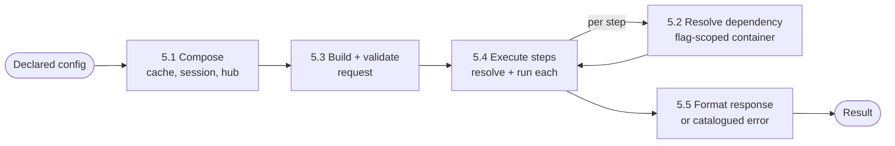

# Core Domain Distillation — Tiferet Framework

**Status:** Draft · **Domain:** `tiferet` · **Code:** `tiferet/` · **Branch:** `docs-domain-vision-distillation`
**Companion:** `docs/domain-vision.md`

## 1. Purpose of this document

The vision statement says *what* Tiferet is for. This document says *how the
framework actually works*: its vocabulary, the bounded steps that turn a
declaration into a running application, the rules that govern how its own
building blocks may depend on one another, and the places where the current
code has drifted from what the framework's own documentation claims about it.
It is the reference a contributor should read before changing the runtime
pipeline, and the reference a reviewer should read before judging whether a
change belongs in the framework layer versus a consuming application.

Tiferet is a single, actively developed codebase rather than a
multi-domain platform, so this document treats the whole framework as one
core domain rather than distilling one subsystem among several.

## 2. The core domain, restated precisely

Tiferet's core domain is **turning a declared application definition into a
running request-execution engine**, and then executing requests against it
uniformly regardless of what the declaration describes.

A Tiferet application is not a program in the ordinary sense. It is a
configuration file — sessions, service registrations, feature workflows, a
catalogued error vocabulary, CLI commands, logging — plus a small set of
single-purpose Python classes the configuration points to by name. Nothing in
the framework hard-codes what a specific application does; the framework
supplies the machinery that reads the declaration, resolves it into live
objects, and drives execution the same way every time.

The domain has one fixed shape:

> **Declare** → **resolve** → **execute** → **respond**

and three axes of variation:

1. **Service implementation** — which concrete class satisfies a declared
   service id, selectable per environment via DI flags
   (`tiferet/domain/di.py:124`, `resolve_service`).
2. **Workflow** — which steps a feature runs, in what order, under what
   conditions, with what parameters and middleware
   (`tiferet/domain/feature.py:317`, `Feature`).
3. **Entry point** — which concrete session-context subclass turns an
   external request (CLI argv, a script call, or, via a custom subclass, an
   HTTP request) into a `RequestContext` and back into a response.

Everything else — resolving dependencies, validating and coercing request
data, iterating a feature's steps, composing middleware, formatting a
catalogued error — is identical no matter which application is declared or
which of the three axes it varies. Section 8 treats the honest exceptions to
that claim directly.

## 3. Ubiquitous language

**AppSession** — the declared shape of one runnable entry point: its id,
logger id, DI flags, service dependencies, and constants
(`tiferet/domain/app.py:33`).

**AppServiceDependency** — one named, injectable service binding an
`AppSession` declares (`tiferet/domain/app.py:18`).

**Feature** — a complete, named workflow: an ordered list of steps plus an
optional request schema, resolvable by a single id such as `calc.add`
(`tiferet/domain/feature.py:317`).

**EventFeatureStep** — one step in a feature's workflow: a service id to
resolve, flags, parameters, result routing (`data_key`), an optional
condition, middleware, and an error-handling policy (`pass_on_error`)
(`tiferet/domain/feature.py:33`).

**ParameterSpecification / RequestSpecification** — a feature's declared
request contract. `RequestSpecification` dynamically reconstitutes its
`ParameterSpecification` entries into a throwaway Pydantic model so a
request's data can be validated and coerced, with every violation aggregated
into one failure, before any step executes (`tiferet/domain/feature.py:185`,
`coerce` at `tiferet/domain/feature.py:271`).

**Flags** — ordered strings attached to an `AppSession`, a `Feature`, or a
step, that select which implementation a service resolves to and are
combined additively (execution flags, then feature flags, then step flags)
at resolution time.

**ServiceRegistration / FlaggedDependency** — one entry in the DI registry: a
default module/class binding plus zero or more flag-qualified overrides.
`resolve_service` returns the effective binding for a flag set: a matching
override first, else the default, else `None`
(`tiferet/domain/di.py:33`, `tiferet/domain/di.py:18`,
`tiferet/domain/di.py:124`).

**ServiceContainer / ServiceResolver** — the resolution machinery. A
`ServiceContainer` (`tiferet/di/core.py:82`) registers and resolves concrete
instances for one flag set; a `ServiceResolver` (`tiferet/di/core.py:186`) is
the template that builds and caches one container per distinct flag set,
delegating actual construction to `build_container`
(`tiferet/di/core.py:254`).

**DomainEvent** — the unit of business logic: one class with an `execute`
method, resolved by service id and invoked via the instantiate-then-execute
pattern (`tiferet/events/core.py:17`, `execute` at
`tiferet/events/core.py:23`, `handle` at `tiferet/events/core.py:224`).

**Service (interface)** — an abstract contract (`tiferet/interfaces/core.py:163`)
a `DomainEvent` depends on for any vertical concern — persistence,
configuration, file I/O — so its logic never imports a concrete
implementation.

**Aggregate / TransferObject** — the mutation and serialization halves of the
mapper layer. An `Aggregate` (`tiferet/mappers/core.py:25`) is a mutable,
validated domain object; a `TransferObject` (`tiferet/mappers/core.py:90`,
`ConfigObject` by convention) is its lenient, round-trippable configuration
representation.

**ConfigurationRepository** — the shared, format-agnostic base every
concrete repository extends, dispatching reads and writes to a YAML or JSON
loader by file extension (`tiferet/repos/core.py:21`).

**BaseContext** — the shared runtime base every operational context extends,
providing a metaclass registry from domain object type to context class
(`ContextMeta`) and the `for_domain` / `from_domain` factory methods
(`tiferet/contexts/core.py:58`, `tiferet/contexts/core.py:91`,
`tiferet/contexts/core.py:117`).

**AppSessionContext (the hub)** — the declaratively constructed runtime
object bound to one loaded `AppSession`, driving every request through the
same four-step `run` pipeline via five injected handler callables
(`tiferet/contexts/app.py:354`, `run` at `tiferet/contexts/app.py:637`).

**FeatureContext** — the context bound to one loaded `Feature`, resolving and
executing its steps (`tiferet/contexts/feature.py:337`).

**RequestContext** — the value carrier for one execution: headers, data, and
the accumulated result.

**CacheContext** — the in-memory cache every hub and feature context shares,
pre-seeded by `build_cache` with the framework's default errors, services,
and constants so a repeated lookup does not repeat the DI or file-read path.

**ErrorContext** — the context that formats a structured response dictionary
from a loaded `Error` domain object and the raised exception's context
(`tiferet/contexts/error.py:66`, `format_response` at
`tiferet/contexts/error.py:76`).

**Middleware** — an ordered, outermost-first chain of callables wrapping a
step's or a feature's execution for cross-cutting concerns (logging, timing),
each required to call `next_fn()` to continue the chain.

**TiferetError / TiferetAPIError** — the framework's catalogued-outcome
exception family: `TiferetError` names a domain outcome by code
(`tiferet/assets/core.py:538`); `TiferetAPIError` is its formatted,
consumer-facing representation (`tiferet/assets/core.py:598`).

**ModelError / ServiceError** — the two non-catalogued exception families for
defects rather than outcomes: `ModelError` (`tiferet/domain/core.py:94`) names
a bad mutation on a domain model; `ServiceError`
(`tiferet/interfaces/core.py:14`) names an infrastructural failure inside a
service. Neither is a `TiferetError`, so neither is localized, caught by the
hub's `run`, or skippable by a step's `pass_on_error`.

## 4. What the domain reads / operates on

Every Tiferet application is declared in one configuration source (YAML or
JSON) with five sections, illustrated by the shipped example application
(`examples/basic_calculator/config.yml`): `sessions` (one `AppSession` per
entry point, e.g. `basic_calc` and `calc_cli`), `services` (the DI registry,
each entry a module path, class name, and constructor parameters), `features`
(the workflow catalogue, keyed by group and key, e.g. `calc.add`), `errors`
(the catalogue every raised `TiferetError` resolves against), and `cli` /
`logging` (command and logging declarations).

Two conventions give the declaration its leverage:

**Dotted feature identity.** A feature's id is derived from `group_id` and
`feature_key` when not given directly (`tiferet/domain/feature.py`'s
`derive_keys` validator), so `calc.add` is simultaneously an id, a lookup key,
and — for the CLI — a command route.

**Parameter prefixes.** A step's declared parameter value can be a literal, a
`$env.`-prefixed reference resolved from the process environment
(`tiferet/blueprints/core.py:491`, `parse_parameter`), or a `$r.`-prefixed
reference resolved from the live request's data
(`tiferet/contexts/feature.py:474`, `parse_request_parameter`). A step's
`condition` is a small boolean expression over the same `$r.` request data
(`tiferet/contexts/feature.py:260`, `evaluate_condition`), letting
`examples/basic_calculator/config.yml`'s `safe_divide` feature skip its
`divide` step declaratively when `$r.b != 0` is false, with no branching code
anywhere in the application.

At runtime the domain also operates on a `RequestContext`'s `headers` and
`data`, populated from whatever the entry point translated an external
request into (CLI argv, a plain script call's keyword arguments, or an
adapter's own request object).

## 5. The behaviors

Each behavior is a bounded step in the request lifecycle. Together they are
what every declared application shares, no matter what it declares.

### 5.1 Application composition

*Turn a declared session id into a fully wired runtime hub.*

`build_app` (`tiferet/blueprints/core.py:869`) chains three composition
functions: `build_cache` (`tiferet/blueprints/core.py:148`) pre-seeds a shared
`CacheContext` with the framework's default errors, services, and constants;
`get_app_session` (`tiferet/blueprints/core.py:218`) resolves the named
`AppSession` (cache first, then the configured app repository);
`build_app_session_context` (`tiferet/blueprints/core.py:803`) builds the
app-level DI container, composes the feature-level resolver, and constructs
the hub. Produces: a wired `AppSessionContext` (or subclass) whose `run`
method is ready to accept requests.

**Verdict:** agnostic to the workflow axis — no feature-specific code runs
here. **Variable, and currently under-realized, on the entry-point axis** —
see Section 8; the session's own `module_path` / `class_name` no longer
selects the context class on this path.

### 5.2 Dependency resolution

*Turn a declared service id, plus the active flags, into a live instance.*

`ServiceResolver.get_dependency` (`tiferet/di/core.py:254`) normalizes the
requested flags, retrieves or builds a `ServiceContainer` for that exact flag
combination, and resolves the id from it. `DIDynamicServiceResolver`
(`tiferet/di/dependency_injector.py:286`) is the concrete implementation:
`build_container` (`tiferet/di/dependency_injector.py:320`) reads every
`ServiceRegistration`, resolves each to its effective `ServiceDependency` for
the given flags via `resolve_service`, and assembles a
`DIDynamicServiceContainer` (`tiferet/di/dependency_injector.py:25`) that
registers services as **Factory** providers (a new instance per resolution).
The app-level container, `DIAppServiceContainer`
(`tiferet/di/dependency_injector.py:209`), is the same machinery registering
services as **Singleton** providers instead, so the small set of app-wide
collaborators (loggers, the error/feature retrieval handlers) are built once
per process. Produces: a resolved service instance, or a raised
`ServiceError` naming the unregistered id.

**Verdict:** fully agnostic to the workflow and entry-point axes. This step
*is* the service-implementation axis — it is the one mechanism that realizes
it, for every declared application alike.

### 5.3 Request construction and validation

*Turn an external call into validated, in-flight request data.*

The hub's `build_request` delegates to an injected `create_request_handler`
(e.g. `create_session_request`, `tiferet/blueprints/core.py:672`) that stamps
the interface id onto headers and seeds a `RequestContext` with the caller's
data. Before any step runs, `FeatureContext.execute_feature`
(`tiferet/contexts/feature.py:728`) calls `validate_request`
(`tiferet/contexts/feature.py:300`), which — only when the feature declares a
`params_schema` — coerces `request.data` against the feature's
`RequestSpecification` and raises a single `REQUEST_VALIDATION_FAILED` naming
every violation on the first failure.

**Verdict:** agnostic to the entry-point and service-implementation axes.
Fully variable on the workflow axis: whether validation happens at all, and
against what schema, is entirely a property of the declared feature.

### 5.4 Feature step execution

*Run a feature's declared steps, in order, against resolved events.*

`FeatureContext.resolve_feature_steps` (`tiferet/contexts/feature.py:675`)
evaluates each step's `condition`, resolves its `DomainEvent` via
`resolve_step_event` (`tiferet/contexts/feature.py:405`, itself delegating to
dependency resolution in 5.2 with feature- and step-level flags combined
additively), and parses its declared parameters. `execute_feature`
(`tiferet/contexts/feature.py:728`) then drives each yielded
`(event, step, params)` tuple through `execute_step`
(`tiferet/contexts/feature.py:518`) or, for an async feature or step, the
`run_coroutine`-driven async counterpart (`tiferet/contexts/feature.py:79`),
composing any feature- and step-level middleware into one ordered chain
per step before invoking `event.execute(**merged_kwargs)`. A step's
`pass_on_error` flag lets a caught `TiferetError` — and only a
`TiferetError`, never a `ModelError` or `ServiceError` — degrade to a `None`
result instead of propagating.

**Verdict:** this is where the workflow axis lives; the loop, condition
evaluation, flag combination, and middleware composition are otherwise
identical for every declared feature.

### 5.5 Error handling and response formatting

*Turn a caught failure, or a completed request, into a uniform result.*

The hub's `handle_error` (`tiferet/contexts/app.py:570`) passes an
already-formatted `TiferetAPIError` straight through, and otherwise delegates
to the injected `raise_error_handler`
(`tiferet/blueprints/core.py:738`), which retrieves the matching `Error`
domain object (cache first, `tiferet/blueprints/core.py:264`), resolves
`ErrorContext.format_response` (`tiferet/contexts/error.py:76`) via the
`BaseContext` registry, and raises the resulting `TiferetAPIError`. On
success, `build_response` (`tiferet/contexts/app.py:609`) delegates to the
injected `response_handler` (`tiferet/blueprints/core.py:782`), which for the
plain path is `request.handle_response()` and for the CLI path
(`tiferet/contexts/cli.py:136`, `CliRequestContext.handle_response`) further
converts the raw result into a typed, printable output model.

**Verdict:** the failure-classification and formatting mechanism (`Error`
lookup, `ErrorContext`, `TiferetAPIError`) is agnostic. Variable on the
entry-point axis: what a *successful* response looks like — a plain value, a
formatted CLI table, a JSON body — is owned entirely by which
`response_handler` and `RequestContext` subclass the entry point wires in.

## 6. How the behaviors compose

`build_app` composes 5.1 once per process invocation. Every subsequent
`run(feature_id, ...)` call on the resulting hub drives 5.2–5.5 in fixed
order: build the request, validate it, execute its steps (each step itself
invoking 5.2 to resolve its event and middleware), and — on success or
caught failure alike — produce a uniform response.

## 7. Relationships / cross-boundary rules

Tiferet arranges its own packages in three layers, and dependencies may only
run downward: **Accessor** (`assets`, `contexts`, `blueprints`), **Actor**
(`domain`, `events`, `di`), **Infrastructure** (`interfaces`, `mappers`,
`utils`, `repos`). Judging whether an import is legal requires knowing which
layer the importing package sits in — the same asymmetry the compiler-domain
distillation documents for Tiferet's own dialect, applied here to the
framework's actual source rather than to a dialect it defines.

Concretely: `domain` depends on nothing else in the framework — it is pure
Pydantic definitions plus the model-error vocabulary
(`tiferet/domain/core.py`). `assets` is the root everyone may draw on. `events`
is the hub of the Actor layer, consuming `assets`, `domain`, `interfaces`,
`mappers`, and `di`, but never `contexts` or `blueprints`. `mappers` depends
only on `domain` and `events`. `di` is deliberately event-free and
asset-free: `domain` and `interfaces.di` only. `utils` and `repos` sit at the
bottom of Infrastructure, resolved into the graph only through DI — `contexts`
and `blueprints` never import them directly. `contexts` consumes `assets`,
`domain`, and `events`, and receives DI resolution only through an injected
`get_dependency` callable. `blueprints` sits at the top: it composes contexts
and DI container/resolver classes, and reaches domain objects only via
`contexts`, never by importing `domain` directly.

This ordering is why dependency resolution (5.2) can be swapped or extended
without touching request execution (5.4): a `FeatureContext` never imports
`di`, it only calls the `get_dependency` callable the hub was constructed
with, so any object satisfying that one-method contract is a legal resolver.

## 8. The agnostic core and the variable edge

**Agnostic — built once, shared by every declared application:**
- Domain object validation and the model-error vocabulary (`domain/core.py`).
- The `DomainEvent` execution/validation/middleware machinery
  (`events/core.py`).
- Flag-scoped dependency resolution and container caching (`di/core.py`,
  `di/dependency_injector.py`).
- The `BaseContext` registry and `from_domain` construction pattern.
- The feature step loop: condition evaluation, flag combination, parameter
  parsing, middleware composition, sync/async dispatch
  (`contexts/feature.py`).
- Catalogued error retrieval and response formatting (`contexts/error.py`,
  `TiferetError` / `TiferetAPIError`).

**Variable — one definition per declared application:**
- Which services exist and which class implementation (and per-flag
  override) each resolves to.
- Which features exist, their steps, conditions, parameters, and middleware.
- The error catalogue's ids, names, and localized messages.
- Which context subclass (and therefore request/response shape) fronts the
  shared engine.

**Currently entangled — the honest inventory:**

- **The entry-point axis is not actually driven by the declared session.**
  `build_app_session_context` hardcodes `context_cls = AppSessionContext`,
  with the comment explaining that "the session's `module_path` /
  `class_name` fields are no longer consulted at runtime"
  (`tiferet/blueprints/core.py`, lines 840–843). The CLI path instead exists
  as an entirely separate top-level entry point,
  `tiferet.blueprints.cli.build_app` (exported as `CLI`,
  `tiferet/blueprints/cli.py:353`), whose own
  `build_cli_session_context` (`tiferet/blueprints/cli.py:286`) hardcodes
  `CliSessionContext` directly (`tiferet/blueprints/cli.py:342`). A consumer
  selects the entry-point axis by *which top-level function they import and
  call* (`App(...)` vs. `CLI(...)`), not by anything written in the
  configuration file.
- **The example configuration still documents the dead field.**
  `examples/basic_calculator/config.yml` (lines 5–9) declares the `calc_cli`
  session with `module_path: tiferet.contexts.cli` /
  `class_name: CliContext`, matching the pattern the entanglement above says
  is no longer read. It is not merely unread — `AppSessionConfigObject`
  (`tiferet/mappers/app.py:280`, fields at lines 292–297) declares no
  `module_path` / `class_name` fields at all, and `TransferObject`'s lenient
  `extra='ignore'` config (`tiferet/mappers/core.py:103`) means those two
  keys are silently dropped on load rather than rejected or acted on. A
  reader of the shipped example has no way to discover, from the
  configuration alone, that these two keys do nothing.
- **`docs/core/contexts.md` and `docs/core/di.md` describe an earlier
  design.** The former documents `AppSessionContext` building
  `FeatureContext` and `ErrorContext` on demand via `for_domain`; the current
  hub instead composes from five externally injected template-method
  handlers (`build_logger_handler`, `execute_feature_handler`,
  `create_request_handler`, `raise_error_handler`, `response_handler`;
  `tiferet/contexts/app.py:392`) and never imports `FeatureContext` or
  `ErrorContext` directly. The latter documents a `tiferet/di/settings.py`
  module and a declarative, event-driven bootstrap wiring
  (`CreateServiceResolver` via `DomainEvent.handle`); the current `di/`
  package contains only `core.py` and `dependency_injector.py`, and
  `blueprints/core.py` composes the resolver directly via
  `build_app_service_container` / `build_service_resolver`
  (`tiferet/blueprints/core.py:432`, `tiferet/blueprints/core.py:532`)
  without importing `events` at all. Both documents describe a real, earlier
  stage of the framework's own evolution rather than an error, but neither
  has been reconciled with the code a contributor will actually find.

None of these is a defect in the request-execution engine itself — 5.1–5.5
work as described. They are defects in the framework's own claim, in its
configuration example and its documentation, about how much of its shape is
actually declarative today. That gap is exactly what Section 10 scopes.

## 9. Boundaries

**Inside the domain:** declaring an application's shape, resolving that
declaration into live, flag-aware service instances, executing a workflow's
steps in order with validated inputs and composed middleware, and returning
either a result or a catalogued, formatted error.

**Outside the domain:**
- The actual business logic inside a `DomainEvent`'s `execute` method — that
  code, and whether it is correct, belongs to the consuming application, not
  the framework.
- Any concrete infrastructure beyond the framework's own YAML/JSON
  configuration repositories and file/CSV/SQLite utilities — a real database
  client, a message queue, an HTTP server — is written by the consumer
  against the framework's `Service` contracts.
- Turning a captured application's structure back into generated source code,
  or verifying that hand-written source conforms to the framework's
  structural conventions — that is the Tiferet Takwin platform's concern
  (its compiler and composer domains), which treats Tiferet applications as
  the material it operates on rather than the engine that runs them.

## 10. Where this leads

1. **Make the entry-point axis real again, or stop implying it exists.**
   Either wire `build_app_session_context` to actually resolve a context
   class from the session's declaration, or remove the vestigial
   `module_path` / `class_name` framing from example configuration and any
   documentation that still describes it as read.
2. **Reconcile `docs/core/contexts.md` and `docs/core/di.md` with the current
   `contexts/app.py` and `di/` package.** Both guides are the canonical
   references contributors are told to read before touching these layers;
   as written, following them would produce code that does not match the
   surrounding codebase.
3. **Decide whether `di/settings.py`'s retirement is complete.** The
   `dependency_injector.py` / `core.py` split appears to fully replace it on
   the `build_app` path; confirming no consumer-facing surface still expects
   the retired module would let the documentation drop it outright rather
   than describe two designs at once.
4. **Audit other session-level configuration keys for the same silent-drop
   pattern.** `AppSessionConfigObject`'s lenient parsing means any stale or
   misspelled key in a session's configuration fails silently rather than
   loudly; a validation pass (or a stricter parsing mode for known sections)
   would surface the `module_path` / `class_name` case before another one
   like it accumulates.

Each is independently scopeable as a TRD; together they are the difference
between the framework this document describes and the framework its own
example configuration and documentation currently claim.
